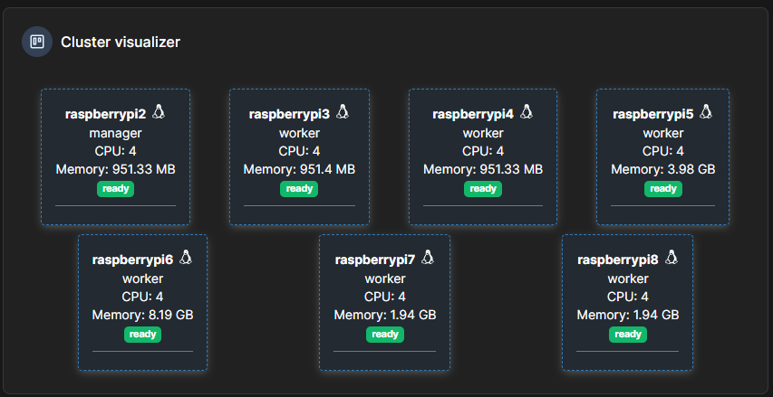

# PiCluster
Raspberry Pi Cluster project

## Introduction

This project aims to build a computer cluster of raspberry pi. Is this going to be more powerful than any modern regular computer ? No, but the goal is to learn many things during the building process, such as network, containerization, parallel programming, etc... The goal is also to make mistakes and learn from them, and to provide a somewhat comprehensive guide for someone who would like to attempt such a project in 2024.

### Table of content

 1. [Hardware setup](#hardware)
 2. [Software setup](#software)
 3. [Useful resources](#useful-resources)

## Hardware

### Raspberry Pis

I purchased 7 Raspberry Pis from several vendors on Facebook Marketplace, and they came with SD cards pre-included. They consists of: 
 - 3x Raspberry Pi 3 Model B+ (1 GB),
 - 2x Raspberry Pi 4B (2GB),
 - 1x Raspberry Pi 4B (4GB),
 - 1x Raspberry Pi 4B (8GB),

for a total of 28 cores and 19 Gb of RAM. According to internet sources, each Raspberry Pi can achieve 5 Gflop/s on average, making this cluster having a combine 35 Gflop/s (0.000000035 EFlop/s), just shy of the [Frontier system](https://top500.org/lists/top500/2024/06/) and its 1.206 EFlop/s ... 

### Network Harware

The cluster setup includes an 8-port network switch, with one port dedicated to connecting to the main network and the remaining seven ports used for linking each Raspberry Pi compute node. Ethernet cables are used for all connections.

### Power source

A suitable power source is essential to power all Raspberry Pis simultaneously. When selecting a power supply, consider its wattage and ampere capacity to ensure it can handle the total power demand of your cluster. Power cables are also needed to connect each node to the source. For this setup, I found a compatible power source on Facebook Marketplace which allows me to power 6 Raspberry Pis.

### Cluster rack

It is a good idea to have proper ventilation for your cluster in order to keep your pies under decent temperature. I bought my cluster rack on [amazon](https://www.amazon.se/GeeekPi-Raspberry-Cluster-Stackerbart-4-lager/dp/B083FP9JRY?th=1)], but I modified it to be able to fit more pis behind the fan. I could have gone for the bigger model but it was more expensive and I wanted to keep my cluster somewhat compact. I used a soldering iron to burn extra holes in the plexiglass plate to be able to mount the pies side by side.

 

### Building the Cluster

*Note: Make sure you do the OS installation before you put the cluster together as it is complicated to access the SD card slots once the cluster rack is assembled.*

Here is a picture of the cluster once fully assembled:

## Software

### Operating System

I installed Raspberry Pi OS Lite (64-bit) on each SD card using the [Raspeberry Pi Imager](https://www.raspberrypi.com/software/), providing a lightweight, stable operating system optimized for server and network applications. This OS choice enables easy configuration and management of the Raspberry Pi cluster.

### Network configuration

I reserved static IP addresses for each Raspberry Pi to ensure consistent identification within the network by accessing my router admin panel. See this [article](https://support.nureva.com/docs/understanding-ip-address-reservation) for more information.
After configuration, I verified that each Pi is recognized on the network, confirming successful connectivity and allowing easier management of individual nodes. 

### Fabric python library

For the initial setup, I used the [Fabric Python library](https://docs.fabfile.org/en/stable/) to send commands to the Raspberry Pis remotely and in parallel. This allowed me to quickly configure each node in the cluster with minimal effort, streamlining the setup process. I have uploaded a [Jupyter notebook](workbook.ipynb) that shows all the commands that I ran to install Docker on all the nodes. 

### Docker and Portainer

I use Docker with Portainer UI to manage my cluster. It has a nice UI and is pretty easy to install (see jupyter notebook for details).

### Hadoop and Spark

I plan on installing Spark and Hadoop followig this [video](https://www.youtube.com/watch?v=FteThJ-YvXk) 

## Useful Resources

https://www.youtube.com/watch?v=FteThJ-YvXk

https://www.youtube.com/watch?v=H2rTecSO0gk

https://www.youtube.com/watch?v=X9fSMGkjtug

https://aricodes.net/posts/building-a-pi-cluster/

https://www.civo.com/blog/kubernetes-vs-docker-a-comprehensive-comparison#:~:text=Docker%20and%20Kubernetes%20are%20both,containers%20across%20clusters%20of%20hosts.
